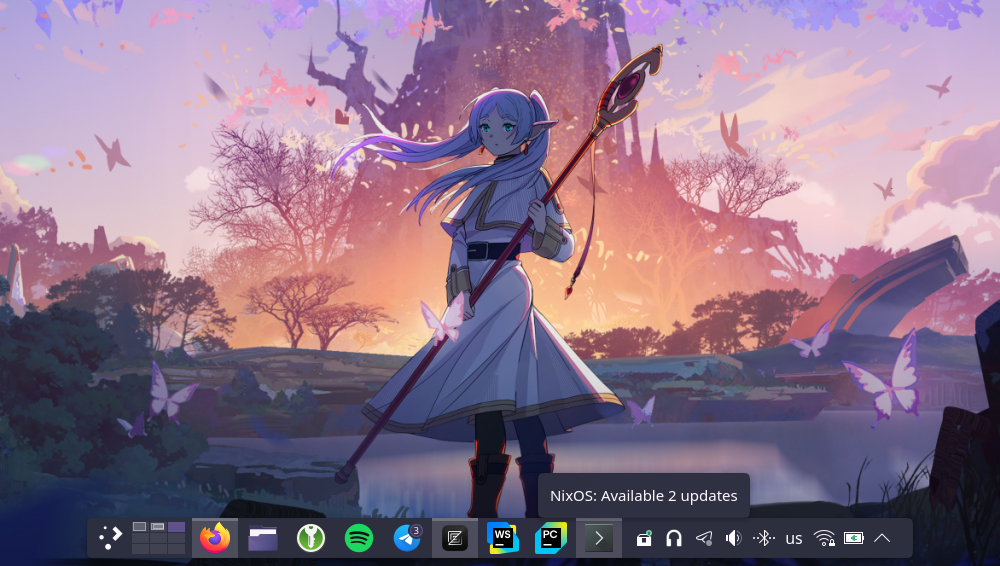

# NixOS Update checker daemon

Simple Python update checker daemon that runs as user service and periodically
checks that system configuration could be updated. Provides simple tray icon with
context menu, that allows you to preview changed packages or re-check for updates.



## Requirements
- NixOS 24.11, with flake configuration and existing flake.lock file;
- Installed and configured [Home manager](https://github.com/nix-community/home-manager).

## How-to

`flake.nix`:

```nix
{
  inputs = {
    # ...
    nixos-updatechecker = {
      url = "github:melianmiko/nixos-updatechecker";
      inputs.nixpkgs.follows = "nixpkgs";
    };
  };

  outputs = inputs@{ nixpkgs, ... }: {
    nixosConfigurations.my-cool-hostname = nixpkgs.lib.nixosSystem {
      system = "x86_64-linux";
      modules = [
        # ...
        inputs.nixos-updatechecker.nixosModules.nixos-updatechecker
        # ...
      ];
    };
  };
}
```

And in your Home manager setup:

```nix
{
  service.nixos-updatechecker.enabled = true;

  # OR full configuration

  service.nixos-updatechecker = {
    enabled = true;
    always-active = false;
    preview-command = "konsole -e bash -c \"cat {} && read\"";
    recheck-interval = 3600 * 12;
    icon-no-updates = "software-updates-inactive";
    icon-updates = "software-updates-updates";
    icon-pending = "task-recurring";
  };
}
```
